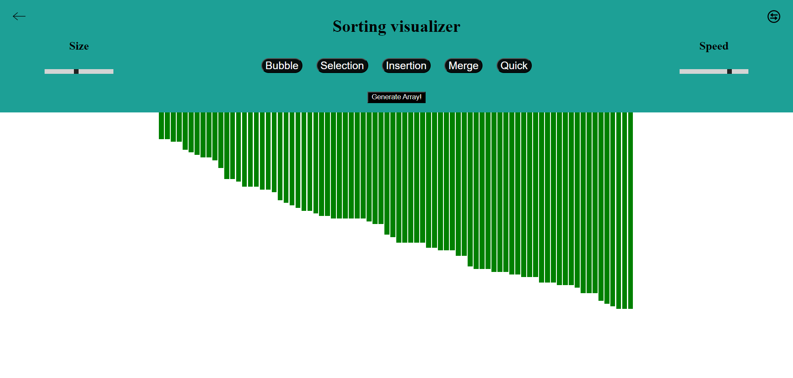

# Sorting Algorithm Visualizer

Welcome to the Sorting Algorithm Visualizer! This is a web-based application that allows you to visualize various sorting algorithms in action. With this tool, you can better understand how different sorting techniques work and compare their performance in real-time.

## Table of Contents

- [Introduction](#introduction)
- [Features](#features)
- [Getting Started](#getting-started)
- [Supported Sorting Algorithms](#supported-sorting-algorithms)
- [Usage](#usage)
- [Contributing](#contributing)
- [License](#license)

## Introduction

Sorting algorithms are fundamental to computer science and play a crucial role in arranging elements in a specific order. The Sorting Algorithm Visualizer provides an interactive way to see how these algorithms function step-by-step, offering insights into their efficiency and behavior for different data sets.

## Features

- Real-time visualization of sorting algorithms.
- Choose from a variety of sorting algorithms to observe.
- Adjustable speed control to slow down or speed up the visualization.
- Random data generation for easy testing and experimentation.
- User-friendly interface for an intuitive experience.

## Getting Started

To use the Sorting Algorithm Visualizer on your local machine, follow these steps:

1. Clone this repository to your computer.
2. Open the `index.html` file in your web browser.

That's it! Now you can explore and interact with the Sorting Algorithm Visualizer.

## Supported Sorting Algorithms

The Sorting Algorithm Visualizer currently supports the following sorting algorithms:

- Bubble Sort
- Selection Sort
- Insertion Sort
- Merge Sort
- Quick Sort
- Heap Sort

## Usage

1. Upon opening the Sorting Algorithm Visualizer, you will be presented with a graphical interface displaying a random set of data that requires sorting.

2. Choose a sorting algorithm from the available options using the dropdown menu.

3. Adjust the speed control slider to set the visualization speed according to your preference.

4. Click the "Sort" button to start the visualization.

5. Observe the algorithm in action as it sorts the data. The visualizer will highlight the elements being compared and swapped, making it easier to comprehend the sorting process.

6. You can reset the data at any time by clicking the "Generate New Data" button.

7. Have fun exploring different algorithms and comparing their performance on various data sets!

## Contributing

Contributions to this project are more than welcome. If you find any issues, want to add new features, or improve existing ones, please feel free to submit a pull request. Before contributing, ensure you read the [Contributing Guidelines](CONTRIBUTING.md).

## License

This project is licensed under the [MIT License](LICENSE). Feel free to use, modify, and distribute the code as per the terms of the license.

---

Enjoy sorting and visualizing the magic of algorithms! If you have any questions or feedback, don't hesitate to get in touch. Happy coding!
